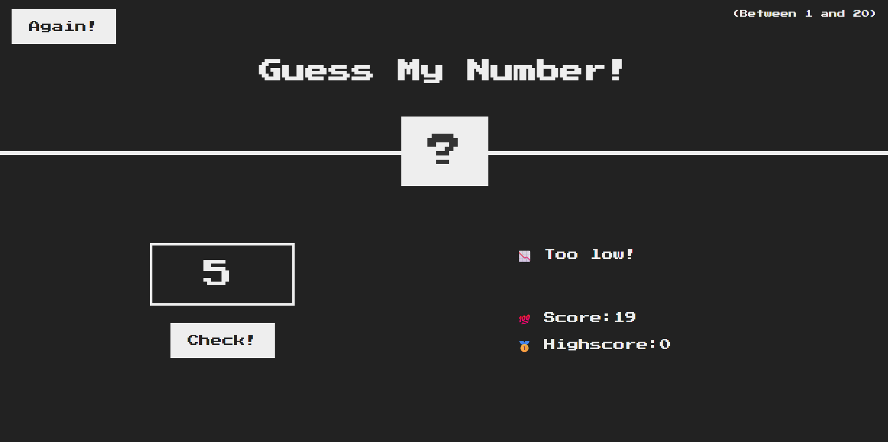
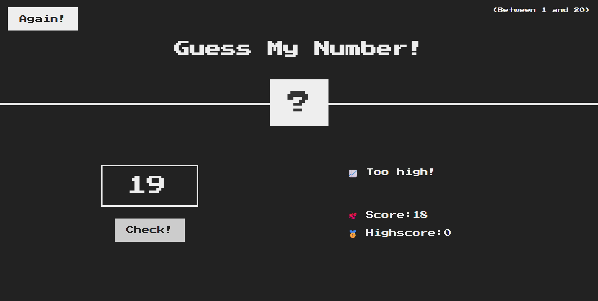
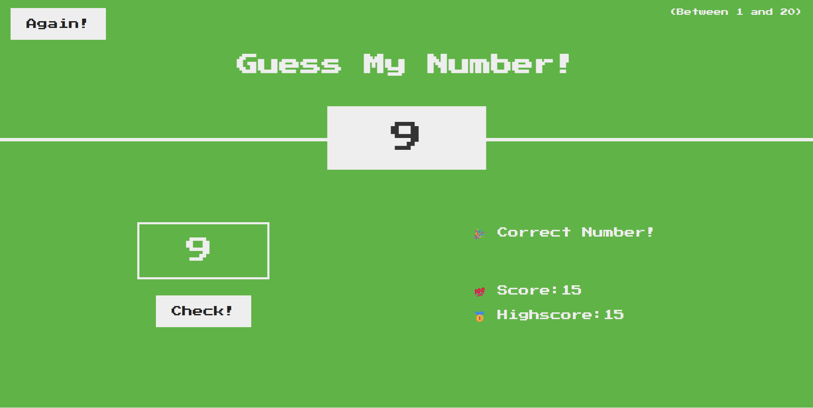
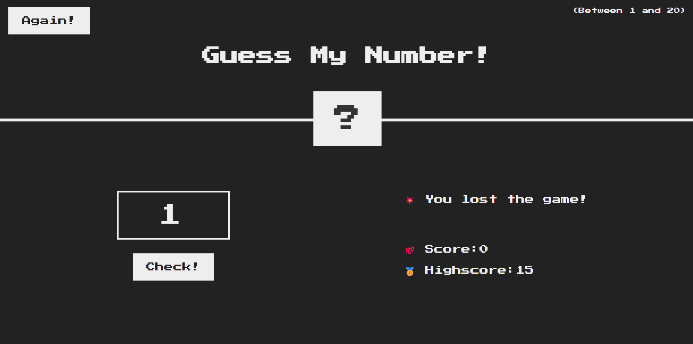

# 🎯 Guess My Number

A fun and interactive number guessing game built with JavaScript that challenges players to find the secret number in the fewest attempts possible.

The game provides instant feedback, score tracking, and a simple yet engaging user experience while demonstrating core JavaScript concepts and DOM manipulation techniques.

## 🚀 Live Demo

**Try it here:** [https://your-guess-my-number-live-link.com](https://mehdysadeghi.github.io/Guess-My-Number/)

---

## 📸 Preview


### Game Interface

```md

```
```md

```


### Winning State

```md id="ay2a6u"

```

### Losing State

```md

```


---

## ✨ Features

* 🎲 Random secret number generation
* 🔢 User number input
* 📈 Score tracking system
* 🏆 High score tracking
* ✅ Instant feedback messages
* 🔄 Restart game functionality
* 🎨 Dynamic UI updates
* ⚡ Fast and interactive gameplay

---

## 🛠️ Built With

* JavaScript (ES6+)
* HTML5
* CSS3
* DOM Manipulation

---

## 📂 Project Structure

```text id="7r0d7u"
Guess-My-Number/
│
├── css/
├── img/
├── js/
│   └── script.js
│
├── index.html
└── README.md
```

---

## ⚙️ Installation

Clone the repository:

```bash id="9k0pzc"
git clone https://github.com/MehdySadeghi/Guess-My-Number.git
```

Navigate to the project folder:

```bash id="o2m0gl"
cd Guess-My-Number
```

Open the project:

```text id="i9h4u9"
index.html
```

For the best development experience, use VS Code Live Server.

---

## 🎓 What I Learned

This project helped me strengthen my understanding of:

* JavaScript fundamentals
* Variables and data types
* Conditional statements
* Event handling
* DOM manipulation
* Dynamic UI updates
* Game logic implementation
* Writing clean and maintainable code

---

## 🔮 Future Improvements

Planned enhancements include:

* Difficulty levels
* Timer mode
* Sound effects
* Dark mode support
* Multiplayer functionality
* Mobile-first redesign
* Leaderboard system
* Improved animations

---

## 🤝 Contributing

Contributions, suggestions, and feedback are welcome.

Feel free to fork the repository and submit a pull request.

---

## 📄 License

This project is open source and available under the MIT License.

---

## 👨‍💻 Author

### Mehdy Sadeghi

Passionate Front-End Developer focused on building modern, responsive, and user-friendly web applications.

GitHub:
https://github.com/MehdySadeghi

Repository:
https://github.com/MehdySadeghi/Guess-My-Number

---

### ⭐ If you found this project useful, consider giving it a star.
